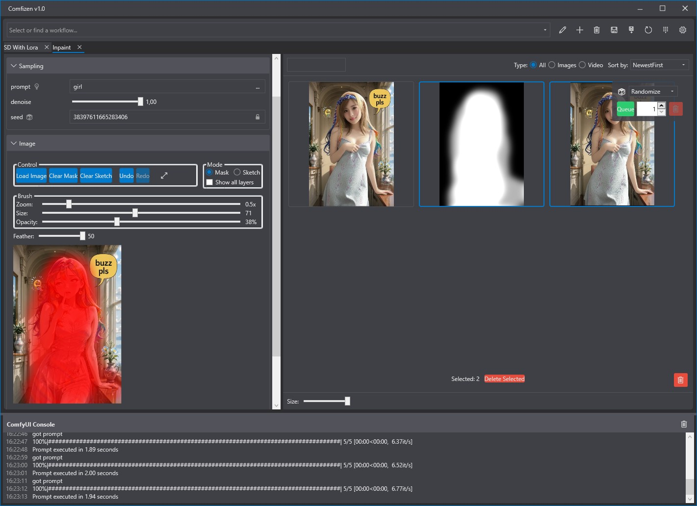
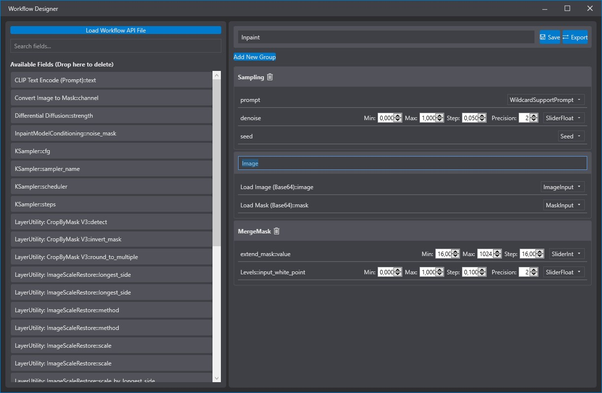
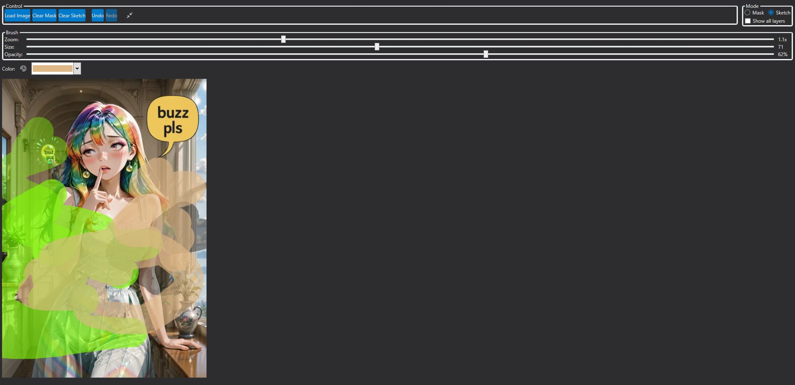
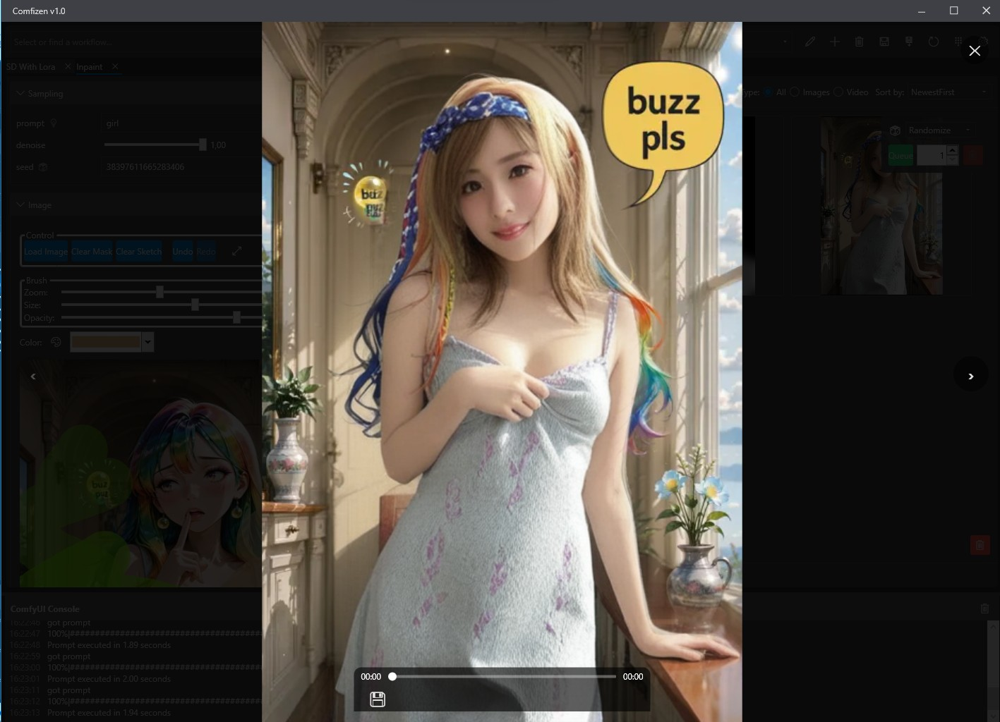

# ComfyUI API Prompt Client

**Comfizen** — это мощное десктопное приложение для Windows, которое кардинально меняет способ взаимодействия с ComfyUI. Оно позволяет превратить любой сложный `API Workflow` в простой, интуитивно понятный и полностью настраиваемый пользовательский интерфейс.

Забудьте о необходимости постоянно работать с запутанной схемой нод. Вынесите только самые важные параметры — промпты, модели, сиды, настройки сэмплеров — в удобные группы, добавьте слайдеры, выпадающие списки и работайте с генерациями как в профессиональном инструменте.

## Создание своего процесса
https://github.com/user-attachments/assets/5a2a2460-b818-4f13-8ed5-5e98e3373572

---

## Требования

- **.NET 8.0 Desktop Runtime:** Для запуска приложения необходима среда выполнения .NET 8.0.
  - [**Скачать .NET 8.0 Desktop Runtime**](https://dotnet.microsoft.com/en-us/download/dotnet/8.0/runtime) (убедитесь, что вы скачиваете версию **Desktop Runtime** для x64).

- **ComfyUI:** Установленная и запущенная копия ComfyUI. Рекомендуется использовать [ComfyUI Manager](https://github.com/ltdrdata/ComfyUI-Manager) для удобной установки кастомных нод.

- **Необходимые кастомные ноды в ComfyUI:**
  - **Для Inpaint/Sketch:** [comfyui-tooling-nodes](https://github.com/Acly/comfyui-tooling-nodes). Необходимы для декодирования изображений и масок, отправляемых из редактора.
  - **Для Консоли:** `Comfyui-ConsoleBridgeNode.py`. Этот файл нужно скачать и поместить в вашу папку `ComfyUI\custom_nodes`, чтобы приложение могло получать логи с сервера.
  
---

## Ключевая концепция: Динамический интерфейс

ComfyUI — невероятно гибкий инструмент, но его графовая структура может быть избыточной для повседневных задач. Если вы отладили свой процесс генерации, вам, скорее всего, нужно менять лишь несколько ключевых параметров.

Это приложение решает именно эту задачу. Оно читает ваш JSON-файл `API Workflow` и позволяет вам визуально спроектировать для него интерфейс:

1.  **Загрузите свой Workflow:** Приложение анализирует файл и находит все возможные поля для ввода (inputs).
2.  **Спроектируйте интерфейс:** Встроенный **Конструктор UI** позволяет перетаскивать найденные поля, группировать их в осмысленные блоки (например, "Основные параметры", "Настройки модели"), переименовывать и задавать им тип элемента управления (слайдер, чекбокс, текстовое поле и т.д.).
3.  **Используйте и генерируйте:** Сохраненный шаблон интерфейса открывается во вкладке, позволяя вам быстро менять нужные параметры и ставить генерации в очередь, не прикасаясь к схеме нод.

Этот подход идеален как для личного использования, так и для предоставления готовых, простых в использовании инструментов для студий или команд.

---

## Основные возможности

### Конструктор UI
Визуальный редактор для создания и настройки интерфейсов.
- **Drag-and-Drop:** Просто перетаскивайте доступные поля из списка в созданные вами группы.
- **Группировка и сортировка:** Организуйте параметры так, как вам удобно.
- **Настройка полей:** Задавайте полям понятные имена и выбирайте для них подходящие элементы управления:
    - **Текстовые поля** (включая многострочные)
    - **Поля для Сидов (Seed)** с кнопкой блокировки
    - **Слайдеры** (для целых и дробных чисел) с настройкой минимума, максимума и шага
    - **Выпадающие списки (ComboBox)** с возможностью задать свои значения или автоматически подгрузить модели, сэмплеры и планировщики
    - **Чекбоксы** (для логических значений `true/false`)
    - **Поддержка Wildcards:** Поля для промптов можно связать с удобным браузером вайлдкардов.
- **Сохранение и редактирование:** Любой созданный интерфейс можно в любой момент отредактировать.

---

### Встроенный Inpaint / Sketch Редактор
Мощный редактор для инпеинтинга и рисования прямо в приложении.
- **Два режима:** Маска (Mask) и Эскиз (Sketch).
- **Настраиваемая кисть:** Регулируйте размер, прозрачность и размытие краев (feather).
- **Пипетка:** Выбирайте цвет для кисти прямо с исходного изображения.
- **Горячие клавиши:** ЛКМ для рисования, ПКМ для стирания.
- **Поддержка Drag-and-Drop и вставки (Paste):** Легко загружайте изображения в редактор.
- **Полноэкранный режим:** Для максимального удобства при работе с деталями.

> **Важно:** Для корректной передачи изображений и масок через API рекомендуется установить кастомные ноды [comfyui-tooling-nodes](https://github.com/Acly/comfyui-tooling-nodes) от Acly. Они добавляют ноды `Image Base64 to Image` и `Mask Base64 to Mask`, которые необходимы для декодирования данных, отправляемых приложением.

---

### Галерея и Просмотрщик
Все сгенерированные результаты отображаются в удобной галерее.
- **Поддержка изображений и видео.**
- **Фильтрация и сортировка:** Быстро находите нужное по имени, типу (видео/изображения) или дате создания.
- **Полноэкранный просмотрщик:** Открывайте изображения и видео в полноэкранном режиме с удобной навигацией.
- **Сохранение и удаление:** Управляйте файлами прямо из галереи.
- **Drag-and-Drop:** Перетаскивайте сгенерированные изображения в другие приложения или в Inpaint-редактор.

---

### Дополнительные возможности
- **Система вкладок:** Работайте с несколькими воркфлоу одновременно.
- **Очередь генераций (Queue):** Запускайте пакетную обработку изображений с автоматическим изменением сида (инкремент, декремент, случайный).
- **Поддержка Wildcards:** Используйте вайлдкарды формата `{__filename__}` или `{option1|option2}` в ваших промптах.
- **Управление сессиями:** Приложение запоминает последние введенные значения для каждого воркфлоу.
- **Консоль ComfyUI:** Отслеживайте логи сервера ComfyUI в реальном времени прямо в приложении.
- **Гибкие настройки:** Настройте адрес сервера, пути сохранения, формат файлов (PNG, JPG, WebP) и многое другое.

---

## Начало работы

1.  **Установите все из раздела "Требования"**
    - Установите .NET 8.0 Desktop Runtime.
    - Установите `comfyui-tooling-nodes` через ComfyUI Manager.
    - Поместите `Comfyui-ConsoleBridgeNode.py` в папку `ComfyUI/custom_nodes`.
    - **Перезапустите ComfyUI.**

2.  **Установите кастомные ноды для ваших воркфлоу (если необходимо):**
    Многие воркфлоу (включая примеры) могут использовать другие кастомные ноды. Если воркфлоу не работает:
    - Нажмите кнопку **"Экспортировать текущее состояние"** в приложении.
    - Загрузите сохраненный JSON-файл в ваш ComfyUI.
    - Используйте **ComfyUI Manager** для поиска и установки недостающих нод.
    - Перезапустите ComfyUI.

3.  **Загрузите воркфлоу в формате API:**
    - В ComfyUI нажмите "Save (API Format)".
    - В приложении, в окне **Конструктора UI**, нажмите **"Загрузить API файл"** и выберите сохраненный JSON.
4.  **Создайте свой интерфейс и сохраните его.**
5.  **Выберите ваш новый воркфлоу в главном окне из выпадающего списка и начните творить!**

---

## Горячие клавиши

| Клавиша         | Действие                                       |
|-----------------|------------------------------------------------|
| `Ctrl + Enter`  | Поставить текущую задачу в очередь генерации   |
| `Ctrl + V`      | Вставить изображение из буфера обмена в Inpaint |
| `Numpad 6`      | (В просмотрщике) Следующее изображение/видео   |
| `Numpad 4`      | (В просмотрщике) Предыдущее изображение/видео  |
| `Numpad 5`      | (В просмотрщике) Сохранить текущий файл        |
| `Escape`        | Выйти из полноэкранного режима (Inpaint/Просмотрщик) |
