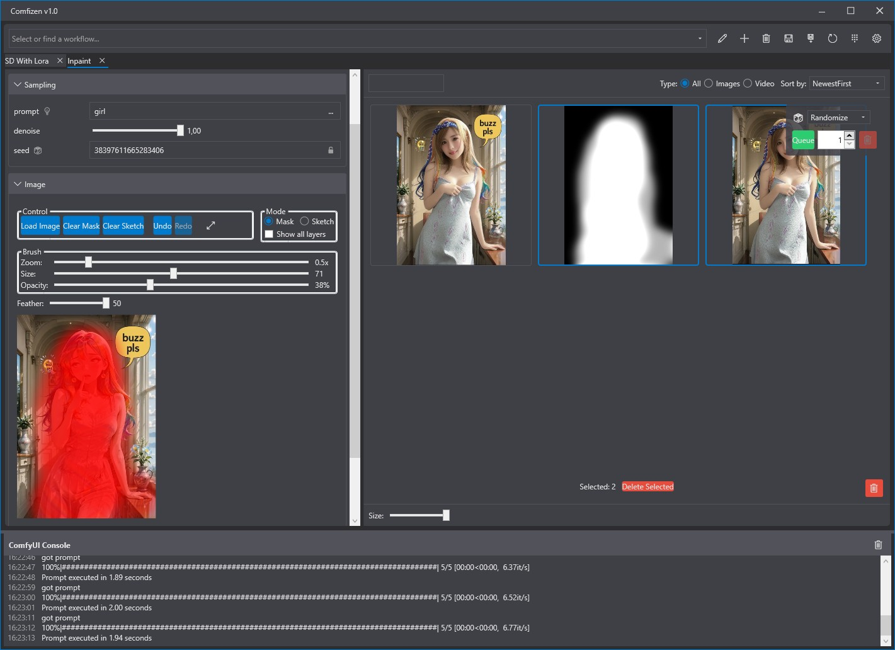
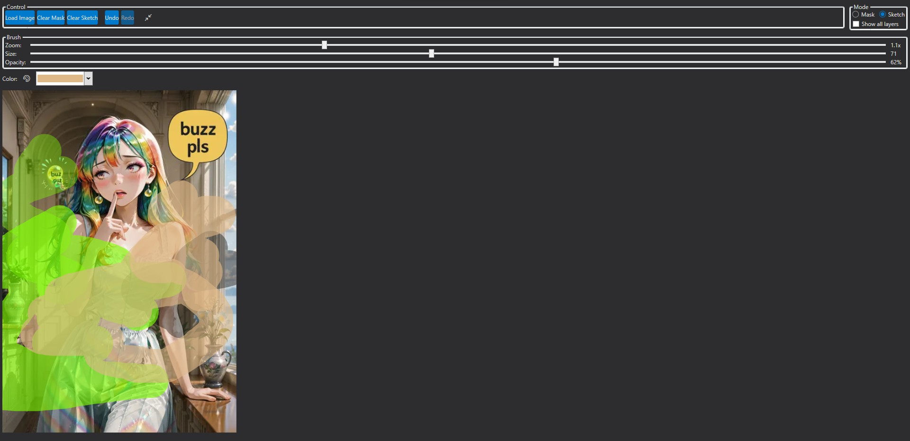

# ComfyUI API Prompt Client

**Comfizen** is a powerful Windows desktop application that revolutionizes the way you interact with ComfyUI. It allows you to transform any complex `API Workflow` into a simple, intuitive, and fully customizable user interface.

Forget about constantly navigating a tangled node graph. Extract only the most essential parameters—prompts, models, seeds, sampler settings—into convenient groups, add sliders and dropdowns, and work with your generations like a professional tool.

---

## Requirements

- **.NET 8.0 Desktop Runtime:** The application requires the .NET 8.0 runtime to launch.
  - [**Download .NET 8.0 Desktop Runtime**](https://dotnet.microsoft.com/en-us/download/dotnet/8.0/runtime) (ensure you download the **Desktop Runtime** version for x64).

- **ComfyUI:** A running instance of ComfyUI. Using the [ComfyUI Manager](https://github.com/ltdrdata/ComfyUI-Manager) is highly recommended for easy installation of custom nodes.

- **Required Custom Nodes for ComfyUI:**
  - **For Inpaint/Sketch:** [comfyui-tooling-nodes](https://github.com/Acly/comfyui-tooling-nodes). Needed to decode images and masks sent from the editor.
  - **For the Console:** `Comfyui-ConsoleBridgeNode.py`. You need to download this file and place it in your `ComfyUI\custom_nodes` folder for the application to receive server logs.

---

## Core Concept: The Dynamic UI

ComfyUI is an incredibly flexible tool, but its graph-based structure can be overkill for daily tasks. Once you've perfected your generation process, you likely only need to change a few key parameters.

This application solves exactly that problem. It reads your `API Workflow` JSON file and lets you visually design a UI for it:

1.  **Load Your Workflow:** The application analyzes the file and identifies all possible input fields.
2.  **Design the Interface:** The built-in **UI Constructor** allows you to drag and drop the discovered fields, group them into logical blocks (e.g., "Main Parameters," "Model Settings"), rename them, and assign them specific control types (slider, dropdown, text field, etc.).
3.  **Use and Generate:** The saved UI template opens in a new tab, allowing you to quickly change the necessary parameters and queue up generations without ever touching the node graph.

This approach is ideal for both personal use and for providing ready-to-use, simplified tools for studios or teams.

---

## Key Features

### UI Constructor
A visual editor for creating and customizing your interfaces.
- **Drag-and-Drop:** Simply drag available fields from a list into the groups you create.
- **Grouping and Sorting:** Organize parameters in a way that makes sense to you.
- **Field Customization:** Give fields clear, human-readable names and choose the appropriate control element:
    - **Text Fields** (including multi-line)
    - **Seed Fields** with a lock button
    - **Sliders** (for integers and floats) with configurable min, max, and step values
    - **Dropdowns (ComboBox)** with custom values or auto-populated lists of models, samplers, and schedulers
    - **Checkboxes** (for boolean `true/false` values)
    - **Wildcard Support:** Prompt fields can be linked to a convenient wildcard browser.
- **Save and Edit:** Any created interface can be modified at any time.

---

### Built-in Inpaint / Sketch Editor
A powerful editor for inpainting and sketching directly within the application.
- **Dual Modes:** Mask and Sketch.
- **Customizable Brush:** Adjust size, opacity, and feathering.
- **Eyedropper Tool:** Pick colors for your brush directly from the source image.
- **Hotkeys:** Left-click to draw, Right-click to erase.
- **Drag-and-Drop & Paste Support:** Easily load images into the editor.
- **Full-Screen Mode:** For maximum precision when working on details.

> **Important:** For proper image and mask transfer via the API, it is recommended to install the [comfyui-tooling-nodes](https://github.com/Acly/comfyui-tooling-nodes) by Acly. They add the `Image Base64 to Image` and `Mask Base64 to Mask` nodes required to decode the data sent by this application.

---

### Gallery and Viewer
All generated results are displayed in a convenient gallery.
- **Supports Images and Videos.**
- **Filter and Sort:** Quickly find what you need by name, type (video/image), or creation date.
- **Full-Screen Viewer:** Open images and videos in a full-screen mode with easy navigation.
- **File Management:** Save and delete files directly from the gallery.
- **Drag-and-Drop:** Drag generated images to other applications or into the Inpaint editor.

---

### Additional Features
- **Tabbed Interface:** Work with multiple workflows simultaneously.
- **Generation Queue:** Run batch jobs with automatic seed control (increment, decrement, randomize).
- **Wildcard Support:** Use `{__filename__}` or `{option1|option2}` style wildcards in your prompts.
- **Session Management:** The application remembers the last used values for each workflow.
- **ComfyUI Console:** Monitor your ComfyUI server logs in real-time within the app.
- **Flexible Settings:** Configure the server address, save paths, file formats (PNG, JPG, WebP), and much more.

---

## Getting Started

1.  **Install All Requirements:**
    - Install the .NET 8.0 Desktop Runtime.
    - Install `comfyui-tooling-nodes` via the ComfyUI Manager.
    - Place `Comfyui-ConsoleBridgeNode.py` into your `ComfyUI/custom_nodes` folder.
    - **Restart ComfyUI.**

2.  **Install Custom Nodes for Your Workflows (If Needed):**
    Many workflows (including the provided examples) may rely on other custom nodes. If a workflow fails:
    - Click the **"Export Current State"** button in the application.
    - Load the saved JSON file into your ComfyUI instance.
    - Use the **ComfyUI Manager** to find and install the missing nodes.
    - Restart ComfyUI.

3.  **Load an API Format Workflow:**
    - In ComfyUI, click "Save (API Format)".
    - In this application's **UI Constructor**, click **"Load API File"** and select the saved JSON.
4.  **Create your interface and save it.**
5.  **Select your new workflow from the dropdown in the main window and start creating!**

---

## Hotkeys

| Key             | Action                                          |
|-----------------|-------------------------------------------------|
| `Ctrl + Enter`  | Queue the current prompt for generation         |
| `Ctrl + V`      | Paste an image from the clipboard into Inpaint  |
| `Numpad 6`      | (In Viewer) Next image/video                    |
| `Numpad 4`      | (In Viewer) Previous image/video                |
| `Numpad 5`      | (In Viewer) Save the current file               |
| `Escape`        | Exit full-screen mode (Inpaint/Viewer)          |